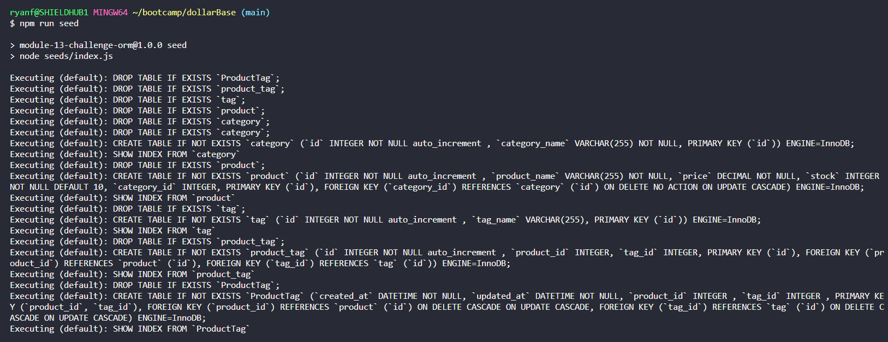
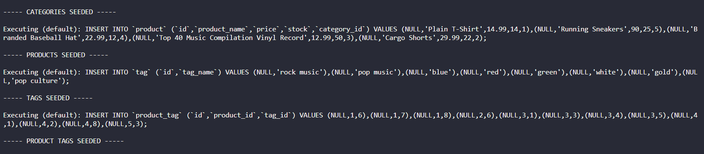
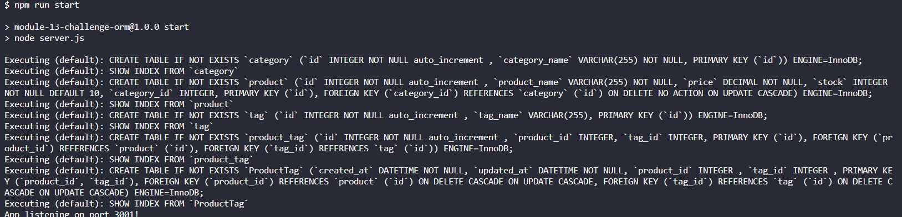

<a id="badges"></a>
[](https://opensource.org/licenses/MIT)

# DollarBase $

## Description

An Ecommerce Backend built using node.js, express.js, MySQL, and Sequelize.

## Table of Contents

1. [Usage](#usage)
2. [Installation Code](#installation)
3. [Screenshot](#screenshot)
4. [Links](#links)
5. [Technologies](#tech)
6. [License](#license)
7. [Testing](#tests)
8. [Questions](#support)

---

<a id="usage"></a>

## Usage

Download the Clone Repo. Install the dependencies. Create a .env file with your database login info. Run the following commands:

<a id="installation"></a>
-First open make sure and source your Database Schema by doing the following:

```
mysql -u root -p
```

Enter your password and then type the following:

```
SOURCE db/schema.sql
```

After that completes you type the following to exit your Database:

```
exit
```

Open another terminal and type the following:

```
npm run seed
```

Then Type the following:

```
npm run start
```

You can check all routes using Insomnia or similar.

---

<a id="screenshot"></a>

## Screenshot






---

<a id="links"></a>

## Links

### Repo Link:

https://github.com/8BitGinger/dollarBase

### Landing Page:

https://8bitginger.github.io/dollarbase/

### Clone Link:

git@github.com:8BitGinger/dollarBase.git

### Live Demo Link:

https://www.veed.io/view/c9da3458-02bd-4e2d-a9c7-34341baaa0d0?panel=share

---

<a id="tech"></a>

## Technologies Used:

[]()
[]()
[]()
[]()
[]()
[]()

---

<a id="license"></a>

## License

[MIT](https://opensource.org/licenses/MIT)

<a id="tests"></a>

## Tests

Tested with Insomnia

<a id="support"></a>

## Questions

**_Reach out for Questions or Support here:_**

#### Email: ryan.fann@gmail.com

#### GitHub Username: [8BitGinger](https://github.com/8BitGinger)
